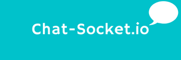
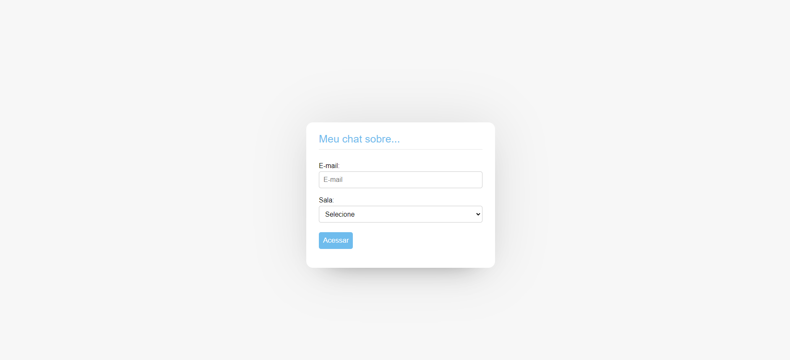
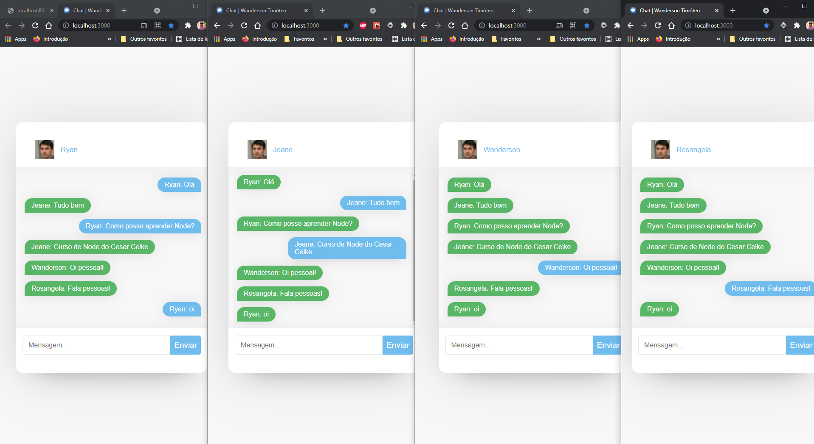

<h1 align="center">
    
</h1>

<p align="center">
  <a href="#-projeto">Projeto</a>&nbsp;&nbsp;&nbsp;|&nbsp;&nbsp;&nbsp;
  <a href="#-tecnologias">Tecnologias</a>&nbsp;&nbsp;&nbsp;|&nbsp;&nbsp;&nbsp;
  <a href="#-executar aplicação">Executar Aplicação</a>&nbsp;&nbsp;&nbsp;|&nbsp;&nbsp;&nbsp;
  <a href="#-licença">Licença</a>
</p>

<p align="center">
 

  
</p>
<br>

## 💻 Projeto

O projeto consiste em um chat de mensagens instantâneas, utilizando socket.io.

As pessoas nas imagens usadas no sistema não existem, foram retiradas do site!
- [This person do es not exist](https://thispersondoesnotexist.com/)
---

<br>

## O que foi desenvolvido neste projeto
### Frontend

- Criando o projeto
```
npx create-react-app NomeDoProjeto
```
- Socket.io é uma biblioteca Javascript para aplicativos da web em tempo real
```
 npm install socket.io-client
 ```
 - Transforma o CSS em componentes
 ```
 npm install --save styled-components
 ```
- Instalar axios
```
npm install --save axios
```
- Criar o Scroll
```
npm install --save react-scroll-to-bottom
```
<br>

---

### Backend
- Criar o arquivo package
```
npm init
```
- Gerenciar as requisições, rotas e URLs, entre outras funcionalidades
```
npm install express
```
- Instalar a dependencia de forma global, "-g" significa globalmente. Executar o comando através do pronpt de comando, executar somente se nunca instalou a dependencia na maquina, após instalar, reiniciar a maquina.
```
npm install -g nodemon
```

- Instalar a dependencia como desenvolvedor para reiniciar o servidor sempre que houver alteração no código-fonte.
```
npm install --save-dev nodemon
```

- Rodar o projeto usando o nodemon
```
nodemon app.js
```

- Socket.io é uma biblioteca Javascript para aplicativos da web em tempo real.
```
npm install socket.io
```
- Permite acesso a API
```
npm install cors
```

- Instalar o Banco de Dados MySQL

- Verificar o Banco de Dados MySQL no pronpt de comando
```
mysql -h localhost -u root -p
```

- Instalar o Workbench para gerenciar o Banco de Dados de forma gráfica

- Sequelize é uma biblioteca Javascript que facilita o gerenciamento de um Banco de Dados SQL
```
npm install --save sequelize
```

- Instalar o drive do Banco de Dados MySQL
```
npm install --save mysql2
```
---
<br>

### Mobile
<br>

- Criar o projeto com React Native usando expo
```
expo init mobile
```
- Executar o projeto 
```
npm start
```
- Socket.IO é uma biblioteca JavaScript para aplicativos da web em tempo real
```
npm install socket.io-client
```

- Realizar chamada para API
```
npm install --save axios
```
- Criar campo do tipo radio
```
npm install react-native-paper
```
- Transforma o CSS em componentes
```
npm install --save styled-components
```


---

<br>

## Prévia vizualização do Front-end
Tela inicial do sistema.

<h1 align="center">
    
</h1>

Tela de mensagens do sistema web.
<h1 align="center">
    
</h1>

Tela inicial do sistema mobile usando expo.
<p align="center">
    
</p>

### Conversa do sistema frontend com mobile

Tela de mensagens do sistema web.
<p align="center">
    
</p>

Tela de mensagens do sistema mobile usando expo.
<p align="center">
    
</p>

<br>

---

<br>

## 🚀 Tecnologias

Esse projeto foi desenvolvido com as seguintes tecnologias:

- [Node.js](https://nodejs.org/en/)
- [Express](http://expressjs.com/pt-br/)
- [React.js](https://reactjs.org/)
- [MySQL](https://www.mysql.com/)
- [Sequelize](https://sequelize.org/master/)
- [Axios](https://axios-http.com/)
- [Cors](https://www.npmjs.com/package/cors#installation)
- [Socket.io](https://socket.io/)
- [Nodemon](https://nodemon.io/)
- [Styled Components](https://styled-components.com/)
- [React Scroll to Bottom](https://www.npmjs.com/package/react-scroll-to-bottom)
- [Expo](https://expo.dev/)
- [React Native](https://reactnative.dev/)
- [React Native Paper](https://reactnativepaper.com/)


<br>

---

<br>

## Executar Aplicação

## 🔥 Executando Localmente a Aplicação

Caso você deseja executar o projeto na sua máquina local, você terá que instalar o Node.js. <br>
Após instalar, basta seguir os passos abaixo:

### 🌀 Começando...

Para começar, você deve simplesmente clonar o repositório do projeto na sua máquina e instalar as dependências.

#### ❗️ Instalando as Dependências (via Windows):

Abre o cmd (caso esteja utilizando o Windows) navegue até o local onde você clonou o projeto

```
cd "C:\Users\NomeDoComputador\Documents\clonedoprojeto"
```

Depois, quando estiver na pasta do projeto Chat-Socket.io, dentro dela terá três pasta uma com o frontend, outra com o backend, e por último a mobile. <br>
Você precisará executar 3 passos: <br>
1 - PASSO <br>
Acessar o projeto frontend na pasta `frontend` digitar no cmd a seguinte instrução: **(dentro da pasta `frontend` do projeto clonado)**

```
> npm install
```

Ao digitar a instrução acima, automaticamente ele irá baixar todas as dependências listadas e definidas no arquivo package.json:

- `node_modules` - que contêm os packages do npm que precisará para o projeto.

#### 💨 Executando a Aplicação

Bom, agora **(dentro da pasta `frontend` do projeto clonado)** abra um terminal para o projeto ser executado e digite:

```
npm start
```

Pronto! dessa forma o projeto frontend estará rodando localmente em sua maquina, acesse:
```
http://localhost:3000
```
<br>

---

<br>

2 - PASSO <br>
Abra outro terminal e acesse o projeto backend na pasta `backend` digitar no cmd a seguinte instrução: **(dentro da pasta `backend` do projeto clonado)**

```
npm install
```

Ao digitar a instrução acima, automaticamente ele irá baixar todas as dependências listadas e definidas no arquivo package.json.

- `node_modules` - que contêm os packages do npm e composer que precisará para o projeto.

#### 💨 Executando a Aplicação

Bom, agora **(dentro da pasta `backend` do projeto clonado)** abra um terminal para o projeto ser executado e digite:

```
nodemon app.js
```

Pronto! dessa forma o projeto backend estará rodando localmente em sua maquina, acesse:
```
http://127.0.0.1:8000/
```
<br>

---

<br>

3 - PASSO <br>
Abra outro terminal e acesse o projeto mobile na pasta `mobile` digitar no cmd a seguinte instrução: **(dentro da pasta `mobile` do projeto clonado)**

```
npm install
```

Ao digitar a instrução acima, automaticamente ele irá baixar todas as dependências listadas e definidas no arquivo package.json:

- `node_modules` - que contêm os packages do que precisará para o projeto.

#### 💨 Executando a Aplicação

Bom, agora **(dentro da pasta `mobile` do projeto clonado)** abra um terminal para o projeto ser executado e digite:

```
npm start
```

Pronto! dessa forma o projeto mobile estará rodando localmente em sua maquina, acesse:
```
http://localhost:19002/
```
<br>

---

<br>

## 🚩 Tenho Dúvidas... O que fazer?

Caso tenham dúvidas sobre o código do projeto, sintam-se a vontade em abrir uma **[ISSUE AQUI](https://github.com/Wanderson-A-Timoteo/chat-socket.io/issues)**. Assim que possível, estarei respondendo a todas as dúvidas que tiverem!

<br>

---

<br>

## Licença

Esse projeto está sob a licença MIT. Veja o arquivo [LICENSE](LICENSE.md) para mais detalhes.

<br>

---

<br>

## Autor:

Feito com ♥ by

-  [**Wanderson A. Timóteo**](https://wanderson.tk)

<br>

---

<br>

## Agradecimentos:

<h1 align="center">
    
</h1>

- Projeto desenvolvido durante a [Imersão Node.js, React e React Native 12.0](https://celke.com.br/home).

- Agradecimento ao [Cesar Celke](https://www.instagram.com/celkecursos/) por compartilhar conteúdo relevante e com qualidade de ensino.

